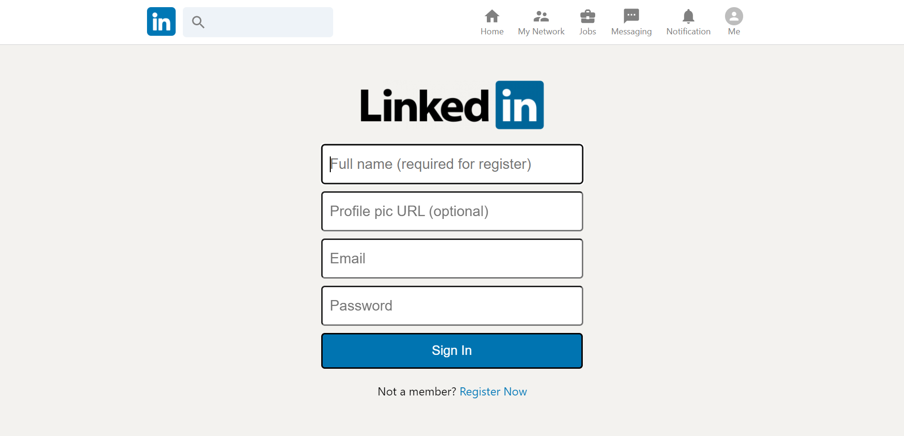

# LinkedIn-Clone
This is a clone of the LinkedIn Web App. I have developed it using React.js, React-redux, React Hooks, Firebase, Firebase-auth, Firebase storage database, react-flip-move, Netlify hosting

### Deployment
| Environment | Link |
|-------------|------|
| Netlify Hosting | [Netlify Preview](https://glowing-licorice-154958.netlify.app/) |

### Technology Stack
#### Frame-Works, PlatForm & Libraries:
- 
- 
- 

#### IDE Used:
- 

#### Version Control:
- 
- 

#### Hosting Server:
- 

### Website Preview:

